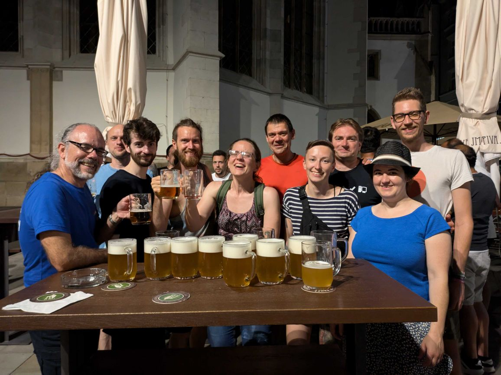

The [2024 Galaxy Community Conference (GCC2024)](https://galaxyproject.org/events/gcc2024/) was held in Brno, Czech Republic, 24-29 June, 2024. 151 participants from 28 different countries, 54 talks, 55 posters/demos, 14 Birds of a Feather and 80 CoFest participants.

## Keynotes

The conference featured notable keynote speakers, including Jana Klánová from Masaryk University, who discussed the integration of exposomics into biomedical sciences. She highlighted the importance of studying environmental exposures and their effects on health, introduced RECETOX, and discussed European initiatives like PARC and EIRENE that support exposome research. Ute Gunsenheimer, Secretary General of the EOSC Association, spoke on building the EOSC Federation and the potential role of Galaxy. Dr. Daria Onichtchouk from the University of Freiburg shared her extensive use of the Galaxy platform in her research on the genetic control of pluripotency, focusing on the maternal to zygotic transition in zebrafish and its underlying mechanisms, including chromatin accessibility and nucleosome affinity.

## Freiburg Galaxy Team Talks in GCC 2024 Talks Sessions

Members of the Freiburg Galaxy team delivered a series of talks at the GCC conference, focusing on various aspects of data analysis and the utilization of Galaxy. Topics included integrating tools, strategies for effectively navigating complex data landscapes, innovative workflow management and optimization approaches, and a pioneering GitHub workflow aimed at automating social media outreach to enhance community engagement. 

* [A Galaxy Workflow Developer's Companion in your Browser](https://docs.google.com/presentation/d/1tXtgGSrUHTsX7adxTr9AzCmdOf2zWn74S_LN3n5HM7U/edit) by David López
* [Enhanced Workflow Management in Galaxy](https://docs.google.com/presentation/d/1vyr7Qa7O2pJ2FZDVFQNlrQypXwhodhzUMTsusD9h6_0/edit#slide=id.g231410debac_0_0) by Alireza Heidari 
* [MAdLand computational resources through Galaxy](https://docs.google.com/presentation/d/1KF6ctfqGpPoNpUF7Fin9ex-vPmICGew6B2gHBf0YfXI/edit#slide=id.g2e386364440_0_195) by Deepti Varshney
* [Navigating the variant landscape: integrating MAVE data analysis into Galaxy](https://docs.google.com/presentation/d/1LGqDHCVEmsYeWxTmLL2Hn4uPiH4PL0rWedBRO_fJdzY/edit#slide=id.p) by Polina Polunina
* [Viral pathogen data analysis with Galaxy](https://docs.google.com/presentation/d/15Df3YZVsDa4PwkBQtP4EMGHyzsovufzmpbgT6YSLgzU/edit) by Wolfgang Maier
* [PathoGFAIR: FAIR Workflows for Pathogen Detection & Samples Comparison](https://docs.google.com/presentation/d/1jNz6uUMV2fnBdG1bfs-S2JAYo5Wqblyk1fR6lRQHWUY/edit) by Engy Nasr
* [Automating Social Media Outreach: A GitHub Workflow for Galaxy Community](https://docs.google.com/presentation/d/11wchlYBzEFcMSn4NEJ0I0h7WM3rGNU5LUm-bL2FuH4c/edit#slide=id.p) by Arash Kadkhodaei

## Poster Sessions

## Trainings

The conference featured various trainings for different levels and divers topics such as Galaxy development, admin and Galaxy-based scientific research.
The Freiburg Galaxy team contributed by providing training for:

* [BioConda & BioContainers](https://galaxyproject.org/events/gcc2024/training/bioconda) by Björn Grüning
* [Machine Learning](https://galaxyproject.org/events/gcc2024/training/machine-learning) by Anup Kumar *et. al.*
* [Galaxy Backend Development](https://galaxyproject.org/events/gcc2024/training/backend-dev) by David Lopez *et. al.*
* [Alphafold in Galaxy](https://galaxyproject.org/events/gcc2024/training/alphafold) by Björn Grüning *et. al.*
* [Pathogen Detection from (Direct Nanopore) Sequencing Data using Galaxy](https://galaxyproject.org/events/gcc2024/training/microbiome-analysis) by Engy Nasr
* [CSS Deep-Dive](https://galaxyproject.org/events/gcc2024/training/frontend-dev) by Laila Los *et. al.*
* [Collecting, Organizing, and Broadcasting Galaxy Tools for a Dedicated Scientific Community (using the Galaxy CoDex)](https://galaxyproject.org/events/gcc2024/training/frontend-dev) by Paul Zierep

## Panel Discussion

## Birds of a Feather (BoF)

## CoFest

## Social Events

### Conference Dinner and Mendel Museum

The conference dinner at the [Augustinian Abbey](https://en.wikipedia.org/wiki/St_Thomas%27s_Abbey,_Brno) at Mendel's square was really special. We had the opportunity to dine where Gregor Mendel conducted his famous experiments. Along with a delicious meal, we enjoyed free access to the Mendel Museum. The guided tours of the abbey, including Mendel's room and the library, were fascinating and provided us with insights into the history of genetics and Mendel's groundbreaking work.

### City Tours and Villa Tugendhat

On Wednesday, we had a delightful day exploring the [Villa Tugendhat](https://www.tugendhat.eu/en/) and [the city of Brno](https://www.gotobrno.cz/en/explore-brno/). A total of 31 people, divided into two groups, visited the Villa Tugendhat, while 66 people in two groups toured the city.

One Villa tour group took the tram, and another group enjoyed a walk despite the warm weather. The Villa Tugendhat visit was particularly special due to its remarkable modernity for its time. Designed by German architect Ludwig Mies van der Rohe, the villa was built in just two years by the wealthy and influential Jewish Czech Tugendhat family. It is recognized as a UNESCO World Heritage Site.

During the city tour, we explored the main sights of Brno's city center with guided tours organized by the Brno Tourist Information Centre. We visited the Old Town Hall, St. Peter's Cathedral, as well as the Freedom and Market Squares. The experience was enjoyable and provided a rich insight into Brno's history and culture.

### Conference Nights Activities

Beyond the enriching presentations and discussions, conference nights were filled with fun and camaraderie. Groups of attendees ventured out to the Bouldering Rock Climbing Hall, testing their climbing skills and bonding over shared challenges. Others enjoyed friendly competitions at local billiards halls.

Dinner outings were a highlight, with groups exploring Brno’s culinary scene, sampling delicious Mexican and Indian cuisine. The evenings often concluded with open-air talks, where participants relaxed and enjoyed local beers and [Kofola](https://en.wikipedia.org/wiki/Kofola) at various pubs and bars, further strengthening connections and creating memorable experiences.

## Thank you: Scientific Committee Members

* Alex Ostrovsky, Johns Hopkins University, United States
* Beatriz Serrano-Solano, Euro-BioImaging ERIC, Germany
* Elliott Price, Masaryk University, Czech Republic
* Enis Afgan, Johns Hopkins University, United States
* Hans-Rudolf Hotz, Friedrich Miescher Institute for Biomedical Research, Switzerland
* Lucille Delisle, Swiss Federal Institute of Technology, Switzerland
* Wendi Bacon, The Open University, England

## Thank you: Organizers

### Conference

* Björn Grüning, University of Freiburg, Germany
* Enis Afgan, Johns Hopkins University, United States
* Helge Hecht, Masaryk University, Czech Republic
* Jenn Vessio, Johns Hopkins University, United States
* Natalie Whitaker, Johns Hopkins University, United States

### Training

* Tyler Collins, Johns Hopkins University, United States
* Assunta DeSanto, Penn State University, United States

### CoFest

* Ahmed Awan, Johns Hopkins University, United States
* Björn Grüning, University of Freiburg, Germany

## Thank you to All GCC 2024 sponsors:

* [JXTX Foundation](https://jxtxfoundation.org/)
* [Worfklow4Metabelomics](https://workflow4metabolomics.org/)
* [GalaxyWorks](https://galaxyworks.io/)
* [GigaScience](https://academic.oup.com/gigascience)
* [KWS](https://www.kws.com/corp/en/)
* [Limagrain](https://www.limagrain.com/en)
* [deNBI](https://www.denbi.de/)

## Thanks to the GCC 2024 hosts

* The City of Brno
* MUNI
* Elixir Czech Republic

